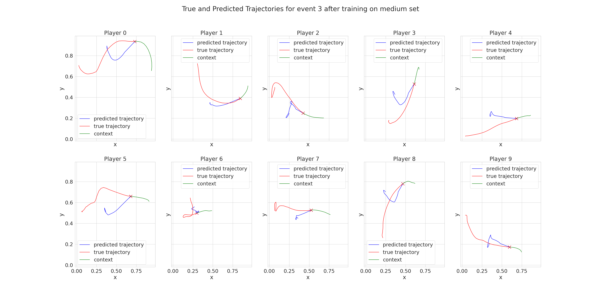

# AgentFormer
This repo contains the agentformer baseline on the basketball dataset 
  
AgentFormer: Agent-Aware Transformers for Socio-Temporal Multi-Agent Forecasting  
Ye Yuan, Xinshuo Weng, Yanglan Ou, Kris Kitani  
**ICCV 2021**  
[[website](https://www.ye-yuan.com/agentformer)] [[paper](https://arxiv.org/abs/2103.14023)]


### Dataset
* We already included a converted version of the basketball data (small, medium and large sets) compatible with the agentformer's dataloader under [datasets/basketball/](datasets/basketball).


### Pretrained Model Results
* We saved the predicted trajectories from the agentformer model trained on the small, medium and large sets under the folder saved_results/{set_type}/test/samples/, where {set_type} is replaced by 'small', 'medium' or 'large'

* To plot the predicted trajectories run the script replacing {set_type} by 'small', 'medium' or 'large' : 
```
python evaluate_bball_performance.py --set_type {set_type}
```
<p align="center">
  
</p>

### Training the models from scratch
* Run the following script to train the agentformer model from scratch, run the following script : 
```
bash do_basketball_extrapolation_{set_type}.sh
```

  This will place the models under the `results` folder. Note that the pretrained models directly correspond to the config files in [cfg](cfg).
  
  The generated samples would be in the `results/user_bball_agentformer_{set_type}/results/epoch_*/test/samples/` folder 
